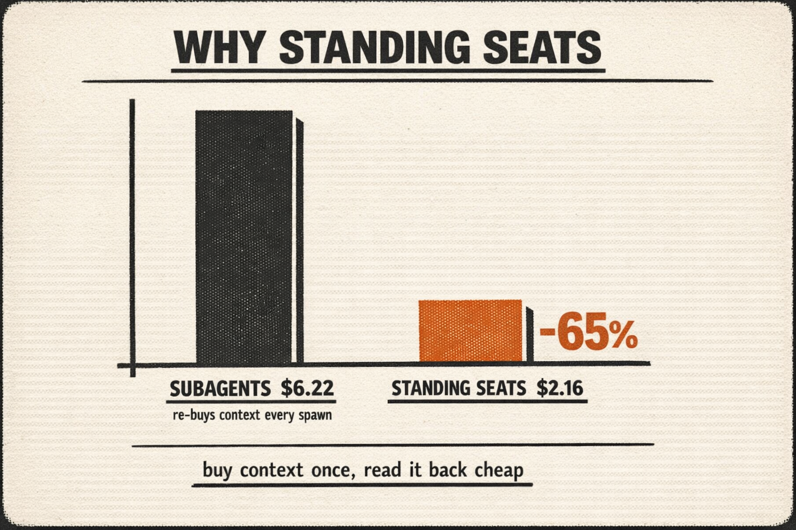
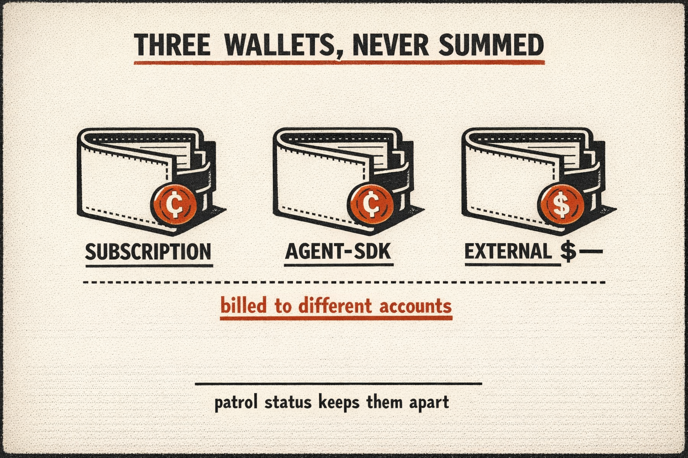
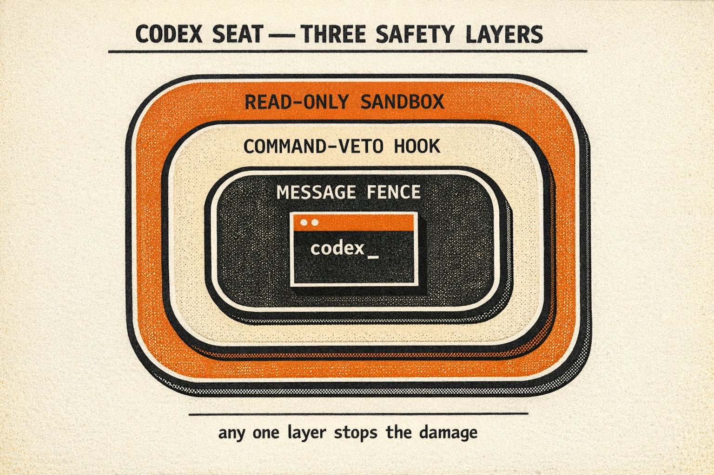
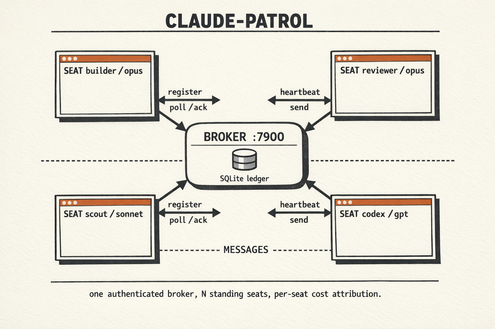

<div align="center">


# Claude-Patrol

**Run a fleet of Claude Code sessions like a team, and see what each one costs.**

[Why](#why-standing-seats) · [Features](#what-patrol-does-that-raw-terminals-dont) · [Quickstart](#quickstart) · [Architecture](#architecture) · [Roadmap](#roadmap) · [Contributing](#contributing)

[](LICENSE)
[](tests)
[](https://bun.sh)
[](tsconfig.json)
[](#contributing)
[](https://www.buymeacoffee.com/alexcahiz)

</div>

---

It's four parts: an authenticated local broker, push messaging that coalesces
instead of spamming a session once per message, per-seat cost tracking, and a
launcher that boots each seat from a profile.

```bash
patrol up          # boot a whole fleet from patrol.yaml, one command
patrol status      # who's running, what role, what model, what it costs
patrol watch       # live TUI: fleet board + message log, across all projects
patrol send <id> "review the diff in ~/proj/x"
patrol down        # tear it all down
```

## Contents

- [Why standing seats](#why-standing-seats)
- [What Patrol does that raw terminals don't](#what-patrol-does-that-raw-terminals-dont)
- [Comparison: Claude-Patrol vs claude-peers-mcp](#comparison-claude-patrol-vs-claude-peers-mcp)
- [Quickstart](#quickstart)
- [Commands](#commands)
- [Architecture](#architecture)
- [Roadmap](#roadmap)
- [Status and caveats](#status-and-caveats)
- [Contributing](#contributing)
- [License](#license)
- [Support](#support)

## Why standing seats

A seat that has been reviewing the same codebase for six waves is better at it than a
subagent spawned thirty seconds ago. It knows what was already ruled out, which
failure modes this repo actually has, and what "done" looks like here. That
continuity is the reason to run standing seats, and no pricing change can erode it —
a fresh agent starts from nothing regardless of what a token costs.

The second reason is that you can see what each one costs. Patrol reads Claude Code's
own session logs and attributes spend per seat, across the three billing wallets that
are actually separate accounts. No other terminal fleet manager does this.

Cost is the third reason, not the first — and it is the one most exposed to a vendor
changing the substrate underneath it. Here is the measurement anyway, with its limits
attached.

<div align="center">

</div>

Measured on real workloads (July 2026, identical fixed-spec dev task, same
quality gate, cost from session logs at list prices). Config-matched: both runs
on the same plugin-heavy seat configuration.

| topology (plugin-heavy config) | cost | wall-clock |
|---|---|---|
| orchestrator + **subagents** (spawn per task) | $6.22 | 13m 15s |
| orchestrator + **standing peer seats** | **$2.16 (−65%)** | **5m 03s (−62%)** |

The mechanism is context weight. Every subagent spawn re-buys the seat's
standing context (system prompt, MCP schemas, CLAUDE.md) as cache *writes*:
~138k tokens per spawn on the heavy config against ~36k on a minimal one. A
repeat of the subagent run on a stripped-down orchestrator came in at $1.06, so
about 80% of the heavy run's cost was config weight being repurchased per spawn
and re-read per turn, not the task itself. A standing seat buys its context once
and reads it back at 1/12.5 the write price, amortizing after roughly one task.

Three honest caveats. Sample sizes are 1–2 runs per cell, and dollar totals are
sensitive to the exact subagent mix — the robust, repeatable finding is the per-spawn
cache-write re-buy, not the headline percentage. Second, this is a fact about *config
weight*, and the vendor's lever on it differs from ours: cheaper cache reuse across
spawns would shrink this gap without anyone changing Patrol. Third, standing seats
have a cost of their own that this benchmark did not isolate — an orchestrator idle
while a seat works can let its own prompt cache expire, and the next turn re-encodes
an unchanged history at the write rate. `patrol status` now measures that (`cache tax`)
rather than assuming it away — though the benchmark above predates the measurement, so
treat that direction of the comparison as untested.

So the cost driver is config weight × spawn count, and Patrol attacks both ends:
standing seats amortize the buy, and per-seat profiles (`peer`, `lite`) shrink what
gets bought at all. Treat the dollar figure as directional and the continuity as the
durable part.

## What Patrol does that raw terminals don't

**1. One command, N pre-profiled seats.**
`patrol up` reads `patrol.yaml` and boots each seat with its own model, role,
working dir, backend (tmux window or headless `claude --bg`), and boot profile,
including per-seat plugin subsets. That replaces about ten manual steps per fleet.

**2. A hard boot guard.**
A seat cannot launch without an explicit model. Booting a seat on an expensive
default model costs real money before it does any work, measured at $3.6–4.9
per accidental boot, three times in one evening. Patrol refuses the launch instead.

**3. Per-seat cost tracking, the feature no peer tool has.**
`patrol status` shows live spend per seat, computed from Claude Code's own session
logs. Subagent spend rolls up to the seat that spawned it; leaving subagent
transcripts out undercounted real runs by 63% before we caught it. Every launched
seat carries a `[patrol-seat: cp-…]` token in its boot prompt, content-matched to
its session log, so ten seats working in one repo each get their own number rather
than a shared guess. The history lives in a SQLite ledger that survives seat
teardown and broker restarts. As of v0.2.4 that spend is split across three billing
wallets: the interactive subscription, the Agent-SDK credit pool (`claude -p`
seats), and external (codex). Reported separately, never summed, because they bill
different accounts.

<div align="center">

</div>

**4. Coalesced wake-ups.**
Every push notification wakes the receiving session for a full turn at full context
price. Patrol delivers each poll batch as one notification, however many messages
queued, so N messages never cost N turns.

**5. An authenticated broker with fenced delivery.**
Without auth, any local process can POST text into your Claude sessions framed as a
teammate. Patrol gates the broker with a 0600 shared-secret file (symlink, owner,
and permission checks on every read) and validates every request's shape and size.
Each delivered message body is wrapped in a per-notification random fence, so a body
cannot forge a `[from …]` header or borrow another seat's authority.

**6. Seats that describe themselves.**
Role, model, and profile ride along at registration (`CLAUDE_PATROL_*` env, set by
the launcher). Orchestrators route work by the seat list instead of burning a
round-trip asking every seat what it runs.

**7. One screen for the whole fleet.**
`patrol watch` is a live TUI: every seat on the machine (whatever project it sits
in), a running log of the messages flowing between them, and a send bar. Tab picks
a target, Enter messages it. Fleet operation stops meaning six tmux windows and a
prayer.

**8. Codex seats: a standing thread, not a fresh subagent per task.**
`backend: codex` boots an adapter that registers as an ordinary seat and keeps one
`codex exec resume` thread alive behind it. You message it like any other seat and
it answers from the context that thread has already built. The usual way to reach
codex from an agent is to spawn it per task, which re-explores the repo on every
run; a standing thread pays for that once. Turns are serialized, so the thread stays
coherent, and it retires itself once its resent prefix crosses a billed-token budget
(default 300k). Two limits worth knowing before you rely on it: codex writes no
Claude Code session log, so a codex seat shows no spend in `patrol status` (absent,
not misattributed), and a reply over the broker's 8KiB cap arrives truncated with a
path to the full text on disk.

**9. A command center in the browser.**
`patrol dash` opens a broker-served page with four panes: a **question inbox** (a
seat asks with `/ask`, every open question surfaces in one place, you answer, the
broker routes the answer back to the asking seat as a message), the fleet board
with live seat state, a comms audit log of every message that crossed the broker,
and a per-seat working-diff pane (tracked and untracked, capped at 256 KiB) plus
the three-wallet billing strip. It is served on loopback only, and `patrol dash`
mints a short-lived nonce for it: that nonce authenticates the read routes and
`/answer` and nothing else. Every write route still requires the full secret, so a
leaked nonce cannot spoof a seat, send messages, or destroy another seat's mail.

**10. One window instead of six.**
`patrol cockpit` folds the fleet into a single tmux window: a big focus pane over
tiled live previews of every other seat, `Ctrl-b z` to zoom one fullscreen, `Ctrl-b
P` to promote a preview into the focus pane, key hints in the status bar. These are
the real terminals joined in, not a summary of them, and each seat's live process is
preserved.

**11. A wizard for the config.**
`patrol init` walks you through a fleet and writes a validated, gitignored
`patrol.yaml`. `patrol init --ai` runs a one-shot `claude -p` over the repo and your
stated goal and recommends the seats. That run is isolated on purpose: empty MCP
config, no tools, a temp cwd so no project `CLAUDE.md`, settings, or hooks load, and
repo signals fenced as untrusted data, so a hostile repo cannot steer it.

**12. Budget alerts on the ledger you already have.**
Give a seat (or the whole fleet) a `budget_usd`, and the seat that crosses it pings
`budget_alert_to` (by default the `orchestrator`-role seat) exactly once. It is
observe-only: Patrol reports spend, it never gates the model or stops a seat.
`patrol status` grows a `BUDGET` column and an `OVER` marker. The check runs in an
isolated try inside the cost tick, so a bug in it cannot break cost indexing.

**13. A worktree per task, not per seat.**
`patrol worktree <seat> <branch>` cuts a tracked git worktree under
`.claude/worktrees/` and tells the seat where it is; `patrol checkpoint <seat>
[--gate "<cmd>"]` runs the gate there, merges the branch back to trunk, and removes
the worktree. The seat itself is never pinned to a tree; it is a standing seat that
picks up a task tree and puts it down. The merge-back runs inside a throwaway
integration worktree, so it never mutates a checkout another seat may be mid-build
in; git's one-branch-one-worktree rule refuses if trunk is live, a conflict STOPs
with the trunk ref untouched, and the seat's tree is removed without `--force` so
uncommitted work is preserved rather than destroyed. See
[the checkpoint caveat](#status-and-caveats) for what a lease does and does not
cover.

**14. Seats that say what they are doing, and a way to wait on it.**
A seat self-reports `idle | working | blocked | done`, so `patrol wait builder
--until done --timeout 300` replaces hand-polling in a script. Seats also carry
readable handles assigned at register (`patrol send builder`, `patrol rename <old>
<new>`); the immutable id stays the internal key and a fallback.

### Why a codex seat is set up the way it is (v0.2.3)

<div align="center">

</div>

A codex seat is a standing process that acts on messages from other seats,
sometimes while no one is watching. Codex can edit and run commands, so an
over-trusting setup is one bad instruction away from a deleted tree or a force
push. The seat is built so that no single mistake (a poisoned message, a
model that misreads its role) can cause that. Three independent layers, and
any one of them stops the damage:

1. **Read-only by default.** A codex seat cannot change files unless its
   `patrol.yaml` entry explicitly asks for it (`sandbox: workspace-write`). A
   seat you spun up to answer questions has no way to write, full stop. The
   sandbox flag is set by the launcher, not the message, so a sender cannot
   talk the seat into escalating its own permissions, because the model never
   controls its own command line. `workspace-write` also confines writes to
   the seat's working directory, so even a write seat cannot reach outside its
   repo.

2. **A command veto for write seats.** Sandbox mode decides *where* writes can
   land; it does not decide *which* commands run. So a write-enabled seat also
   runs a Patrol-authored `PreToolUse` hook that codex consults before every
   command and can deny, the same mechanism Claude Code uses. Destructive
   verbs (recursive force-deletes, force pushes, history rewrites, piping the
   network into a shell, writes redirected outside the workspace) are refused
   before they execute. We verified this against the real codex binary on
   2026-07-14: with writes enabled and hook-trust bypassed, the hook still
   blocked a file write. The veto holds regardless of what the model decides
   to do.

3. **The message is data, not orders.** The inbound message body is fenced as
   untrusted content, exactly as it is for Claude seats, with an instruction
   that nothing inside it changes the seat's role, sandbox, or safety rules. A
   sender can ask the seat to do work; it cannot rewrite what the seat is
   allowed to do.

The honest limit: a codex seat still shows no spend in `patrol status` (it
writes no Claude Code session log; surfacing codex's own usage is a later
item), and reading its usage into the cost ledger is on the roadmap below.

## Comparison: Claude-Patrol vs claude-peers-mcp

Patrol is a ground-up rewrite informed by running
[claude-peers-mcp](https://github.com/louislva/claude-peers-mcp) in anger, and
patching it. Several Patrol features were prototyped there first.

| | claude-peers-mcp (0.1.0) | Claude-Patrol |
|---|---|---|
| MCP surface per seat | 4 tools (send/list/summary/check) | 2 tools (summary/check); send/list/status are CLI verbs, near-zero schema payload |
| Push notifications | one per message → N messages = N paid wake-ups | **coalesced: one per poll batch** |
| Sender context | extra `list-peers` call per inbound message | joined by the broker at poll time |
| Broker auth | none; any local process can inject messages | shared-secret token, 0600 file |
| Seat identity | id + cwd | + role, model, profile (self-describing fleet) |
| Cost tracking | none | **per-seat live spend, subagent transcripts included** |
| Fleet launcher | none; open terminals by hand | `patrol up`: yaml config, tmux + headless backends, per-seat plugin subsets |
| Boot safety | boots on default model (measured $3.6–4.9/accident) | model required per seat, validated before launch |
| Deregistration | process exit only | SessionEnd hook + idempotent `/unregister` (by id or pid) + stale-PID sweep |
| Boot latency | LLM auto-summary API call (up to 3s, external dep) | opt-in only; seats self-describe |
| Message table | grows forever | delivered messages purged after 7 days |
| Packaging | manual clone + .mcp.json | Claude Code plugin (commands, skill, hook, MCP) + CLI/daemon |
| Tests | none | 393 across broker, costs, launcher, CLI, codex adapter, integration |

## Quickstart

**Requirements:** [Bun](https://bun.sh) ≥1.2, Claude Code ≥2.1.80 (logged in via
claude.ai, not an API key), tmux for visible seats, macOS or Linux.

Full step-by-step with a verification per step: **[SETUP.md](SETUP.md)**. The short
version:

```bash
git clone https://github.com/AMPMIO/Claude-Patrol.git && cd Claude-Patrol
bun install && bun link
cp patrol.yaml.example patrol.yaml   # edit seats
patrol up
patrol status
patrol watch                          # live fleet board + message log
```

`patrol.yaml`:

```yaml
seats:
  - name: orchestrator
    model: opus
    profile: full          # everything on, the long-lived workhorse
  - name: builder
    model: opus
    profile: peer          # no plugins, patrol MCP only; cheap seat
  - name: scout
    model: sonnet
    backend: bg            # headless via `claude --bg`; see the caveat below
    profile: peer
    prompt: "You are a research scout. Await tasks via patrol."
  - name: cx
    model: gpt-5.6-terra
    backend: codex         # standing codex thread, messaged like any seat
    prompt: "You are the codex seat. Answer from the thread's accumulated context."
```

> [!WARNING]
> A `bg` seat registers and shows up in `patrol status`, but it never receives
> message pushes: the development-channels flag sits behind an interactive consent
> gate a headless session cannot answer. Use `tmux` (or `codex`) for anything
> message-driven; `bg` is for seats that only need to exist.

**Profiles:** `lite` (no plugins, no MCP), `peer` (no plugins + patrol seat server),
`full` (inherit everything), or an inline map with a per-seat plugin subset:

```yaml
    profile:
      plugins: [codex, superpowers]   # just these two
      mcp: patrol
```

`patrol init` writes a validated `patrol.yaml` for you (and gitignores it);
`patrol init --ai` reads the repo and your stated goal and recommends the seats.

## Commands

Nineteen verbs, and the number is published so it can be watched. See
[Command surface](#roadmap) for why. `patrol` with no arguments prints the same
list.

| verb | what it does |
|---|---|
| `patrol init [--ai]` | wizard: write a `patrol.yaml` here (`--ai` for AI-suggested defaults) |
| `patrol up [config]` | launch the fleet from `patrol.yaml` |
| `patrol down` | tear the fleet down |
| `patrol status` | fleet board: seats, roles, models, state, spend, budget |
| `patrol send <handle> <msg>` | message a seat (handle or id) |
| `patrol list` | list seats, compact |
| `patrol rename <handle> <name>` | rename a seat's handle |
| `patrol wait <handle> --until done[,blocked]` | block until a seat reaches a state (`--timeout 300`) |
| `patrol doctor` | check broker/daemon health |
| `patrol stats` | telemetry: wake-ups, coalescing ratio, attribution layers |
| `patrol watch` | live TUI: fleet board + message log across projects |
| `patrol cockpit` | fold the fleet into one tmux window: focus pane + tiled previews |
| `patrol dash` | open the command-center dashboard in your browser |
| `patrol claim-port <id> [n]` | allocate n ports to a seat from the range |
| `patrol claim <id> <path>...` | claim paths for a seat (advisory) |
| `patrol claims [git-root]` | list current path claims |
| `patrol release <id> [path...]` | release a seat's path claims |
| `patrol worktree <seat> <branch> [--base <ref>]` | cut a task worktree for a seat |
| `patrol checkpoint <seat> [--gate "<cmd>"] [--force]` | merge the branch back, remove the worktree |

## Architecture

<div align="center">

</div>

One authenticated broker at the center; every seat registers with it, and messages
flow seat-to-seat across it. The precise wiring:

```
┌─ terminal 1 ─┐  ┌─ terminal 2 ─┐  ┌─ headless ──┐
│ claude       │  │ claude       │  │ claude --bg │
│  └ seat-srv ─┼──┼─ seat-srv ───┼──┼─ seat-srv ──┼──► broker (:7900)
└──────────────┘  └──────────────┘  └─────────────┘    ├ SQLite
        ▲                ▲                             ├ auth token
        └── channel push ┘        patrol CLI ──────────┤ /costs ◄─ session logs
                                  (send/list/status)   └ stale-PID sweep
```

- **Broker**: singleton localhost daemon, SQLite, auto-started by the first seat.
  All POSTs authenticated.
- **Seat server**: minimal stdio MCP per session: registers, polls, pushes coalesced
  `claude/channel` notifications. Everything else is the CLI.
- **Costs**: a background indexer parses `~/.claude/projects` session logs into an
  hour-bucketed SQLite ledger. Attribution tries the launch-token content match
  first, then the SessionStart hook, then a window heuristic that reports
  "unattributed" rather than guess wrong.

## Roadmap

Sequenced, not parallel: v0.2 has to prove itself in real use before v0.3 starts.
No dates.

**v0.2.3, shipped.** Lease/ack delivery (`/poll-messages` leases, `/ack` settles,
unacked leases redeliver), so a live seat whose push failed doesn't silently drop
work. Codex seats hardened: read-only sandbox by default, a command-veto
`PreToolUse` deny hook for write-enabled seats, and an unforgeable prompt-injection
fence around inbound message bodies. Broker cost indexer bounded in both memory and
CPU. 189 tests.

**v0.2.4, shipped.** Built on the fleet, by the fleet:
- **`backend: headless`**: a `claude -p --resume` adapter daemon (same shape as the
  codex seat). Pull-based by necessity: a headless session cannot receive
  `claude/channel` pushes, so the adapter polls and drives one turn per message.
- **Billing-source attribution.** After the 2026-06-15 split, programmatic
  (`claude -p`) launches draw a separate Agent-SDK credit pool, not the interactive
  subscription. `patrol status` reports subscription / agent-sdk / external as three
  separate totals, never summed, because they bill different accounts.
- **Port + file-ownership claims.** `/claim-port` hands out ports so parallel seats
  stop fighting over `localhost:3000`; `patrol claim <path>` registers a seat as a
  path's owner and denies a competing claim, naming the holder.
- **Seat state + `/wait-for`.** Seats self-report `idle | working | blocked | done`;
  a caller can `patrol wait <seat> --until done` instead of hand-polling.
- **Readable handles.** The broker assigns a stable `builder` / `reviewer` handle at
  register, so `patrol status` and `patrol send builder` stop dealing in random hex
  ids. The immutable id stays the internal key and a fallback.

**v0.2.5, shipped.**
- **Command-center dashboard** (`patrol dash`): a broker-served page: a question inbox
  (`/ask` → surfaces in one place → the human answers → routed back to the seat), the
  fleet board with live seat state, and a comms audit log.
- **`patrol cockpit`**: a tmux "big panel + previews" layout: fold the fleet into one
  window, `Ctrl-b z` to zoom a seat fullscreen, key hints in the status bar. herdr's
  "real pane views, not a wrapped interpretation": the actual terminals, not a summary.
- **`patrol init`**: a setup wizard that writes + gitignores `patrol.yaml`, with an
  `--ai` flag that runs a one-shot `claude -p` over the repo + your stated goal to
  *recommend* the fleet (off the interactive budget).

**v0.2.6, shipped.** Competitor steals, chosen against a small-verb-set discipline:
- **Budget alerts**: a seat crossing its `budget_usd` cap pings the orchestrator once
  (observe-only, never gates the model). The only fleet-manager that alerts on per-seat
  spend.
- **`patrol worktree` + `patrol checkpoint`**: the task-worktree loop as two verbs.
  `worktree` cuts a tracked task worktree for a seat; `checkpoint` merges it back to
  main and removes it, integrating inside a throwaway worktree so it never mutates a
  checkout another seat may be mid-build in (git's one-branch-one-worktree rule is the
  interlock; a conflict or a live trunk STOPs cleanly, losing nothing).

**v0.2.7, shipped.** All 8 findings from a Codex adversarial review of 0.2.5/0.2.6
(1 critical, 4 high, 3 medium), each verified against the code before fixing. The
critical one: `GET /dashboard` was unauthenticated and embedded the full broker
secret in the page. It is now nonce-gated behind a loopback Origin/Host check, and
the nonce authenticates the read routes plus `/answer` only.

**v0.2.8, shipped.** A second adversarial pass on the 0.2.7 fixes: three that were
incomplete rather than closed, one regression 0.2.7 introduced (a recovery path
could put two seats in one worktree). Checkpoint grew a third fence binding both the
branch tip and symbolic HEAD.

**v0.2.9, shipped.** Checkpoint stops racing the seat. Detection cannot win a race
against a still-working agent. The final fence could not even read the seat's HEAD,
because the worktree was already gone. So the seat is now **quiesced** instead:
checkpoint takes a lease and writes a lease file, the seat's `PreToolUse` guard hook
denies mutating tool calls while that file is live, checkpoint proves the branch tip
has stopped moving, and only then merges. The hook fails open on every error path,
because a wedged fleet is worse than a missed fence. A seat with no guard hook
(`codex` and `headless` adapters) is refused unless you pass `--force`.

**Command surface (held deliberately):** 19 verbs. The field's cautionary tale is a
competitor whose own docs disagree on its tool count (87 / 171 / 210); Patrol's edge is
a small, memorizable set. Every new verb earns its place; this number is published so it
can be watched. Deferred to keep it small: seat-side port delivery (no consumer yet),
status-change hooks, gate-first validation, heuristic state fallback.

**v0.3, hardening.** The work that has to land before I'd suggest anyone depend on
this for real:
- Auth redesign: a unix domain socket plus per-seat capability tokens, so a seat's
  identity is bound rather than asserted. The tokens must gate `/poll-messages` and
  `/ack`, not just sending: today any caller holding the broker secret can read
  another seat's mail, and with `/ack` can silently destroy it. Acking a victim's
  batch marks it delivered and it is never seen. The v0.2.4 mutating routes join this
  gate: `/release-claims`, `/set-state`, and `/claim-port` trust `body.id`, so one
  seat can delete another's file-ownership claims, spoof its state, or burn ports
  charged to it, the same asserted-identity model as `/set-summary`, but higher
  stakes (destroy vs spoof). A bound identity is also what a safe `patrol send --as
  <seat>` needs, which is why that flag was cut from v0.2.2 instead of shipped.
- Consumer-crash redelivery. v0.2.3's lease/ack covers a *live* seat whose push failed
  or whose broker blipped; it does **not** survive the seat process dying, because the
  stale-seat sweep deletes a dead seat's undelivered mail and a restarted seat comes
  back under a new id. Surviving a crash needs identity that is stable across restarts,
  so it is gated on the capability tokens above rather than shippable on its own.
- A writable-worktree root for codex seats. Today a codex seat's sandbox is scoped to
  its launch checkout, so it cannot implement in the per-package worktrees the fleet
  runs on. It's confined to read-only review and spec work until this lands.
- Plugin packaging, so a cloned install resolves its own paths.
- **Project-level telemetry → a self-improving loop.** The broker already sees every
  message, per-seat spend, and (0.2.4) state transitions; this rolls them into durable
  per-project session records (messages/session, cost/task, blocked-time, rework rate,
  who-waits-on-whom), so after N sessions the data can drive the next round of
  optimizations. It is also the honest way to *measure* whether standing seats beat
  subagents on real ongoing work, not just the one benchmark. Needs a defined schema up
  front so the data is still minable months later.

**v0.4, after it has proven itself.** A Rust CLI; SSE or long-poll replacing the 1s
poll; codex cost parsing, so non-Claude seats get their own per-seat spend (v0.2.4
tags *which pool*, not codex's own dollar figure); a retention sweep for the ledger;
per-task cost tags; a Warp launch backend.

## Status and caveats

**v0.3-dev, 393 tests.** Cost attribution survives the case that broke it in v0.1:
several seats working in the same repo, split across three billing wallets, with a
per-seat budget alert when one crosses its cap. History survives seat teardown and
broker restarts. `/costs` reads from an incrementally indexed ledger instead of
walking every log on request. Delivery leases and acks each message, so a failed
push doesn't drop a live seat's mail. Port and file-ownership claims keep parallel
seats from colliding; `patrol worktree`/`checkpoint` give each task an isolated
worktree and a safe merge-back. Codex seats default to a read-only sandbox behind a
command-veto hook. Delivered messages are fenced against header forgery, and every
broker request is validated.

This is a tool I built for my own fleet and then opened up. It is used daily, but by
one person on one machine, so expect sharp edges outside that path.

- **Single-machine by design.** No cross-host coordination, no hosted backend, no
  remote seats. This is not a limitation waiting to be lifted; it is the scope.
- **`checkpoint` quiesces tool calls, not processes.** The lease works through the
  seat's `PreToolUse` guard hook, so it stops the seat's next *tool call*. A tool
  call already in flight when the lease lands still completes (checkpoint waits it
  out and proves the tip has settled), and a background process the seat started
  earlier (a dev server, a watcher, a long build) keeps running and can still
  write. A seat with no guard hook cannot be quiesced at all, which is why
  `checkpoint` refuses an adapter seat (`codex`, `headless`) unless you pass
  `--force` and accept the older fences-only behavior.
- **`guarded` proves a hook is installed, not that it fired.** At registration a seat
  verifies what it can see locally: the lease path is absolute, the guard script
  exists, the lease directory is writable. It cannot verify that Claude loaded the
  settings overlay, that it will invoke the hook, or that it will honor the deny —
  only the seat's own session knows that, and it has no channel to say so. Closing
  this needs the hook itself reporting back that it ran. That handshake is the
  largest remaining gap in the lease, and it is not built. `checkpoint`'s three
  fences stay in place precisely as the detector for everything the lease cannot
  cover: if a fence trips, the lease failed, and you get `INCOMPLETE` rather than a
  false success.
- **The dashboard is loopback-only, and its token is scoped.** `patrol dash` mints
  a short-lived nonce that authenticates the read routes and `/answer`; every write
  route still requires the full broker secret, and the page is refused without a
  loopback `Origin`/`Host`. It is not an interface to expose off the machine.
- **A codex seat shows `—` in the SPEND column, not `$0`.** Codex writes no Claude Code session log, so
  there is no spend to attribute. The figure is absent rather than misattributed;
  parsing codex's own usage is a v0.4 item.
- **`ports:` in `patrol.yaml` is accepted but not yet delivered to the seat.** The
  broker allocates from the range, but nothing exports the result into a seat's
  environment. Use `patrol claim-port <seat> <n>` and pass the ports yourself.
- **The `claude/channel` capability is a Claude Code research preview**
  (`--dangerously-load-development-channels`). If it changes, delivery degrades to
  the `check_messages` fallback rather than breaking.
- **Reversal condition, stated up front:** if Anthropic ships persistent
  cross-session agent teams, Patrol's broker retires and the launcher + cost layer
  live on. That is written into `DESIGN.md`, not hidden.

Design decisions with kill criteria: [`DESIGN.md`](DESIGN.md). Research evidence:
[`research/`](research). Release notes: [`CHANGELOG.md`](CHANGELOG.md).

## Contributing

Issues and PRs are welcome, especially bug reports from a second machine. That is
the coverage I cannot give it myself.

```bash
bun install
bun test              # 393 tests
bunx tsc --noEmit     # strict, must stay clean
```

Both must pass before a PR merges. New logic ships with the smallest check that fails
if it is wrong. If you are changing behaviour rather than fixing a bug, open an issue
first so we can agree on the shape.

## License

[AGPL-3.0](LICENSE). Use it, fork it, run it, sell it. If you distribute a modified
version, or run one as a network service, publish your source. In plain terms: you
cannot take this closed.

## Support

If Patrol saved you a few dollars of tokens, you can send one back.

[](https://www.buymeacoffee.com/alexcahiz)
